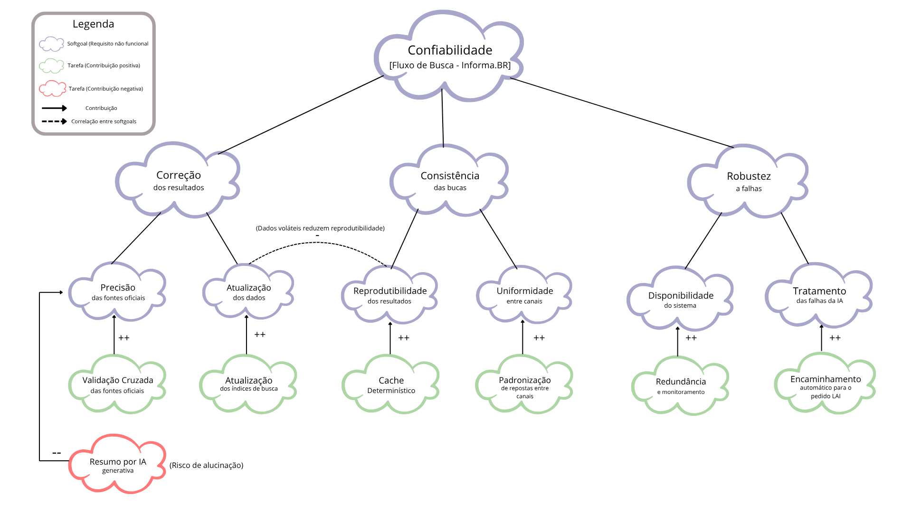

# SubEquipe_02
O relatório deverá conter a estrutura de focos estabelecida a seguir, bem como versionamentos, metodologia e participantes por foco.
Não omitir tópicos.

## Focos do Relatório:
### FOCO_01: Artefatos Generalistas & NFR Framework

A entrega referente ao FOCO 01 consistiu na elaboração de um artefato generalista, no caso, uma Rich Picture, construída a partir da análise do fluxo de busca do sistema Informa.br. Além disso, foi elaborado um Grafo de Interdependência de Software (SIG), segundo a notação do NFR Framework, tendo como requisito não funcional de referência a Confiabilidade.

### Participantes no Foco_01

| Lorena Ribeiro Martins | 
| Pedro Augusto Ribeiro Faitarone Bessa |

### Metodologia do Foco_01
O trabalho neste Foco partiu da técnica de **Rich Picture** proposta por Monk & Howard (*Methods & Tools: Rich Picture*, ACM Interactions, 1998), adotando o operador central (o Cidadão que busca informação) como ponto de partida do desenho, e organizando os demais stakeholders em círculos de proximidade — do núcleo operacional (Cidadão × sistema de busca) até os stakeholders mais periféricos (CGU e Órgãos Públicos federais, representados na borda superior da imagem, conforme recomenda a técnica).
 
Como insumo de conteúdo, reaproveitou-se a Engenharia Reversa do fluxo de busca do portal **Informa.BR** (CGU), já documentada no FOCO_02 deste relatório (elementos gráficos, transições de estado e regras de negócio inferidas). Isso garantiu que o Rich Picture não fosse apenas uma ilustração livre, mas sim uma representação **rastreável** às mesmas regras de negócio e ao mesmo fluxo formalizado em BPMN no Foco anterior. Complementarmente, foi feita uma pesquisa sobre o lançamento oficial do Informa.BR (CGU, maio–junho de 2026) para identificar com mais precisão os stakeholders institucionais (CGU, Órgãos Públicos federais, canal de suporte) e as fontes de dados agregadas pela plataforma (Portal da Transparência, Portal de Dados Abertos e respostas via LAI/Fala.BR), já que o acesso direto e interativo ao site (que depende de JavaScript) não é possível para automação/scraping.
 
O desenho foi elaborado de forma iterativa: (i) levantamento dos stakeholders e de suas preocupações (viewpoints), (ii) posicionamento do Cidadão como figura central, (iii) inclusão dos elementos de sistema (motor de busca com IA, fontes de dados, controle de autenticação SSO), (iv) inserção dos balões de pensamento (concerns) de cada stakeholder, e (v) identificação explícita de um ponto de tensão/conflito (expectativa de resposta imediata do cidadão × prazo legal de até 20 dias, prorrogável por mais 10, para resposta a pedidos via LAI). Optou-se por manter o escopo do Rich Picture restrito exclusivamente ao **fluxo de busca**, sem detalhar o fluxo interno de tramitação de pedidos formais da LAI (fora do escopo combinado com a equipe).

Para a elaboração do SIG, foi realizada uma análise do site Informa.BR, com foco na identificação e compreensão do seu fluxo de busca. A partir dessa análise, foi selecionado o processo de pesquisa e consulta de informações como foco da entrega, considerando sua relevância para a interação do usuário com o sistema.

Com base nas características observadas nesse fluxo, foi definido o critério de Confiabilidade para a elaboração do SIG na notação do NFR Framework, buscando avaliar aspectos como a correção dos resultados, a consistência das buscas e a capacidade do sistema de lidar com situações de falha.

### Rich Picture
O Rich Picture abaixo representa os principais stakeholders, fluxos de interação e preocupações (concerns) envolvidos no fluxo de busca do portal Informa.BR:
 
- **Cidadão** (operador central): formula a demanda em linguagem natural e recebe um resumo com links diretos às fontes.
- **Informa.BR** (motor de busca com IA): processa a consulta e consolida resultados de múltiplas fontes oficiais.
- **Fontes de dados**: Portal da Transparência, Portal de Dados Abertos e respostas já publicadas via LAI/Fala.BR.
- **CGU**: mantenedora institucional da plataforma, interessada em unificar buscas hoje fragmentadas.
- **Órgãos Públicos Federais**: produtores/curadores dos dados de origem, responsáveis por manter a rastreabilidade das fontes.
- **Login Único (SSO gov.br)**: controla o acesso ao fluxo alternativo de "Fazer Pedido" (LAI), mantendo a busca livre a qualquer visitante.
- **Suporte Informa.BR**: canal de contato (e-mail) para dúvidas ou falhas de atendimento.
- **Ponto de tensão**: expectativa de resposta imediata do cidadão versus prazo legal de até 20 dias (+10 prorrogável) para resposta formal via LAI.

<em>Figura: Rich Picture – Fluxo de Busca no Portal Informa.BR, na técnica de Monk &amp; Howard (Clique na imagem para ampliar com zoom ou <a href="/Base/Imagens/Rich%20Picture.svg" target="_blank" data-lightbox>abra o arquivo SVG em tela cheia</a>).</em>

*Referências: MONK, A.; HOWARD, S. The Rich Picture: A Tool for Reasoning About Work Context. Interactions, ACM, v. 5, n. 2, mar./abr. 1998, p. 21-30; conteúdo de Engenharia Reversa produzido no Foco_02 deste relatório; CGU. Notícias sobre o lançamento do Informa.BR (maio-junho de 2026), disponível em gov.br/cgu.*

### NFR Framework

O diagrama abaixo formaliza, em notação NFR Framework, o requisito de Confiabilidade identificado a partir da análise do fluxo de busca do Informa.BR, organizado em três níveis hierárquicos: **softgoal raiz** (Confiabilidade), **subgoals** (decompostos em dois níveis via relações AND) e **tarefas operacionalizadoras**, que materializam decisões concretas de design. O grafo cobre desde a decomposição do requisito não funcional até as tarefas que o operacionalizam, ligadas por meio de contribuições positivas ou negativas, estas últimas com uma justificativa associada. Uma correlação entre subgoals de ramos distintos representa um trade-off identificado na análise, o ganho de Confiabilidade obtido pela atualização frequente dos dados pode comprometer a Reprodutibilidade das buscas.

<em>Figura: SIG de Confiabilidade em notação NFR Framework – Fluxo de Busca no Portal Informa.BR.</em>

*Referências: CHUNG, Lawrence; NIXON, Brian A.; YU, Eric; MYLOPOULOS, John. Non-functional requirements in software engineering. Boston: Springer, 2000; material de apoio da disciplina (Notação NFR Framework — Profa. Milene).*
#

### FOCO_02: Engenharia Reversa & Modelagem BPMN
Entrega Mínima: um modelo, na notação BPMN, do fluxo do software encontrado com a Engenharia Reversa.
Mira-se no MM no FOCO, com a entrega mínima.
### Participantes no Foco_02
| Fábio Alessandro Santos Vieira |

### Metodologia do Foco_02
A Engenharia Reversa foi iniciada com uma revisão bibliográfica sobre o tema, seguida de uma análise do portal de acesso à informação de um governo ([informabr](https://informabr.cgu.gov.br/)), para identificar seus elementos funcionais e estruturais. Com base nisso, e nas quatro etapas do processo de Engenharia Reversa, definimos o escopo e as responsabilidades da equipe.

### Processo de Engenharia Reversa Aplicado
Aplicou-se Engenharia Reversa a partir de um insumo de alto nível de abstração — a interface gráfica de um portal de governo eletrônico (inspirado em uma plataforma real de transparência e acesso à informação) - [informabr](https://informabr.cgu.gov.br/), com foco exclusivo no **fluxo de busca**.
 
O processo seguiu as quatro etapas da literatura de Engenharia Reversa (Chikofsky & Cross):
1. **Levantamento dos elementos gráficos visíveis**
2. **Identificação das transições de estado**
3. **Inferência de regras de negócio a partir de validadores e mensagens**
4. **Documentação padronizada de cada interação, seguida da formalização em um diagrama de fluxo de navegação (BPMN)**.
 
**1. Elementos gráficos identificados**
- Campo de busca em destaque (entrada de texto livre, em linguagem natural);
- Botão/ícone de busca (lupa) e confirmação por tecla Enter;
- Botão de destaque "Fazer Pedido" (chamada para ação alternativa quando a busca não é suficiente);
- Menu de navegação superior e botão de autenticação via login único (SSO);
- Tela de resultados com resumo gerado por IA e lista de links diretos às fontes;
- Rodapé institucional com contato de suporte.
**2. Transições de estado identificadas**
- Ao confirmar a busca com o campo vazio → o sistema não avança e permanece na mesma tela;
- Ao confirmar a busca preenchida → o sistema processa a consulta e exibe a tela de resultados;
- Ao clicar em um link de resultado → o sistema direciona o usuário à fonte correspondente;
- Ao clicar em "Fazer Pedido" sem estar autenticado → o sistema redireciona para o login único;
- Ao concluir a autenticação → o sistema retorna o usuário ao fluxo interrompido.
**3. Regras de negócio inferidas**
- Obrigatoriedade de preenchimento do campo de busca, com mensagem de validação em caso de campo vazio;
- Autenticação obrigatória apenas a partir da intenção de registrar um pedido — a busca em si é aberta a qualquer visitante;
- Indicação da origem/fonte de cada resultado retornado, para rastreabilidade da informação.
**4. Documentação padronizada (usuário clica em X → sistema exibe Y)**
 
| Ação do usuário | Resposta do sistema | Regra de negócio inferida |
| -- | -- | -- |
| Acessa o portal | Exibe a tela inicial com campo de busca em destaque | Acesso à busca não exige autenticação |
| Digita a demanda e confirma a busca (campo vazio) | Exibe mensagem de validação solicitando o termo de busca | Campo de busca é obrigatório |
| Confirma uma busca preenchida | Processa a consulta e exibe um resumo com links diretos às fontes | Resultado deve indicar a origem de cada item |
| Clica em um link de resultado | Direciona à fonte correspondente, encerrando a jornada de busca | — |
| Não encontra o que procura e clica em "Fazer Pedido" | Verifica autenticação; se ausente, redireciona ao login único antes de prosseguir | Registro de pedido exige autenticação

*Referências: CHIKOFSKY, E. B.; CROSS, J. H. Reverse engineering and design recovery: a taxonomy. IEEE Software, 1990; material de apoio da disciplina (Engenharia Reversa e Reengenharia; Engenharia Reversa; BPMN — Profa. Milene).*

### Modelagem BPMN
O diagrama abaixo formaliza, em notação BPMN, o fluxo de busca reconstruído acima, organizado em duas raias (lanes): **Cidadão (Usuário)** e **Plataforma (motor de busca com IA)**. O fluxo cobre desde o evento de início (necessidade de informação) até dois eventos de fim possíveis: (a) informação obtida diretamente pela busca; ou (b) encaminhamento para o subprocesso de registro de pedido formal, tratado como fora do escopo deste Foco. Um gateway exclusivo representa a regra de obrigatoriedade do campo de busca, incluindo o caminho de correção do erro.

<em>Figura: Diagrama BPMN – Fluxo de Busca no Portal (Clique na imagem para ampliar com zoom ou <a href="/Base/Imagens/BPMN%20-%20Fluxo%20de%20Busca%20no%20Portal.svg" target="_blank" data-lightbox>abra o arquivo SVG em tela cheia. Feito no</a>).Feito no figma.</em>

### FOCO_03: IA Generativa
Entrega Mínima: pontos de vista de cada membro da equipe sobre as lições aprendidas e uso da IA Generativa.
TODOS DEVEM PARTICIPAR!
### Participantes no Foco_03
| Nome do Membro | Lições Aprendidas | Uso da IA Generativa (SENSO CRÍTICO) |
| --- | --- | --- |
| Fábio Alessandro Santos Vieira | Compreendi na prática o processo e as etapas da Engenharia Reversa ao analisar e recuperar o fluxo de busca de um portal de governo eletrônico, além de aprofundar na formalização de processos através da notação BPMN (utilizando raias, eventos e gateways de decisão). | A IA generativa foi utilizada para auxiliar na transcrição e estruturação das informações levantadas na Engenharia Reversa, permitindo transformar anotações mais abstratas e de nível macro em uma documentação técnica concreta e padronizada. Além disso, tentei gerar o modelo BPMN através da IA, porém o resultado gerado foi extremamente confuso e desorganizado, com elementos sobrepostos. Diante dessa limitação, optei por realizar a modelagem da notação BPMN manualmente para garantir precisão e clareza. |
| Lorena Ribeiro Martins | Compreendi na prática a técnica de Rich Picture (Monk & Howard) como ferramenta de comunicação centrada no usuário, aprendendo a identificar stakeholders, seus concerns e pontos de tensão a partir de um fluxo já reconstruído via Engenharia Reversa. | A IA generativa foi utilizada para consolidar, em um único desenho (SVG), os stakeholders, fluxos e regras de negócio já levantados no Foco_02, além de apoiar a pesquisa sobre o contexto institucional real do Informa.BR (lançamento pela CGU). Todo o fluxo de busca foi levantado de maneira manual, para entender melhor como funciona, depois desse estudo foi gerado o rich picture com IA, porém, como podemos observar ela não traz uma qualidade muito boa, tendo alguns textos um em cima do outro.|
| Pedro Augusto Ribeiro Faitarone Bessa | Compreendi melhor como decompor um requisito não funcional em softgoals mensuráveis por meio do NFR Framework, com o SIG de Confiabilidade escolhido. Isso me ajudou a enxergar como um mesmo fluxo analisado pode gerar artefatos complementares, alguns mais interpretativos e outros mais técnicos, e como decisões de design concretas (tarefas) se conectam a critérios de qualidade abstratos por meio de relações de contribuição e trade-offs entre softgoals. | A IA generativa foi utilizada para pesquisar e organizar informações sobre o funcionamento do Informa.BR, e isso ajudou na escolha do critério de Confiabilidade. A IA também ajudou na construção do SIG, mas o modelo gerado por ela ficou extremamente simples, e não adequado aos padrões do NFR Framework, apesar disso, o modelo gerado acabou servindo de inspiração geral para o modelo construido, que foi uma versão aprofundada dessa versão inicial. |

#
## Versionamentos
| Nome do Membro | Contribuição | Data |
| --- | --- | --- |
| Fábio Alessandro Santos Vieira | 1. Execução do processo de Engenharia Reversa (levantamento de elementos gráficos, transições de estado, regras de negócio e documentação padronizada do fluxo de busca no portal). 2. Elaboração e desenho da Modelagem BPMN no Figma e inclusão do artefato SVG. 3. Redação do Ponto de Vista com Senso Crítico sobre o Uso da IA Generativa e Lições Aprendidas. | 27/08/2026 |
| Lorena Ribeiro Martins | 1. Elaboração do Rich Picture (técnica de Monk & Howard) do fluxo de busca do Informa.BR, com base na Engenharia Reversa do Foco_02 e em pesquisa complementar sobre o contexto institucional da plataforma. 2. Inclusão do artefato SVG e redação da Metodologia do Foco_01. 3. Redação do Ponto de Vista com Senso Crítico sobre o Uso da IA Generativa e Lições Aprendidas. | 27/08/2026 |
| Pedro Augusto Ribeiro Faitarone Bessa | 1. Elaboração do SIG de acordo com a notação NFR Framework 2. Descrição sobre o ponto de vista sobre a IA generativa. | 27/08/2026 |

--
# Observações: 
Entregável: Relatório, documentado no GitPages, revelando:
## Entrega Mínima (por subgrupo da equipe): um artefato generalista (ESCOPO: Rich Picture ou Mapa Mental), um SIG na notação do NFR Framework, um modelo, na notação BPMN, do fluxo do software encontrado com a Engenharia Reversa, e pontos de vista de cada membro da equipe sobre as lições aprendidas e uso da IA Generativa. Mira-se no MM, com a entrega mínima.

## Como ir além, para conseguir menções superiores?
Embasar cada artefato gerado e cada decisão tomada na literatura;
Manter rastros claros para o trabalho em equipe (ex. vídeos das reuniões e atas bem elaboradas), evidenciando práticas metodológicas (ex. reuniões periódicas das metodologias ágeis; checklists; debates, e assim vai);
Usar os vários recursos de modelagem, seja do NFR Framework, seja da notação BPMN, e
Reportar os pontos de vista de forma fundamentada, clara e com senso crítico.

## 📌A ideia não é quantidade, e sim qualidade do que é entregue.

## Apresentação:
Apresentação (para a professora) explicando o artefato elaborado, com: (i) rastro claro aos membros participantes (MOSTRAR QUADRO DE PARTICIPAÇÕES & COMMITS); (ii) justificativas & senso crítico sobre o trabalho realizado, e (iii) comentários gerais sobre o trabalho em equipe. Tempo da Apresentação: +/- 10min. Recomendação: Apresentar diretamente via Wiki ou GitPages do Projeto. Baixar os conteúdos com antecedência, evitando problemas de internet no momento de exposição nas Dinâmicas de Avaliação.

A Wiki ou GitPages do Projeto deve conter, PARA CADA SUBGRUPO, um tópico dedicado ao relatório com a entrega mínima, versionamentos, referências, e demais detalhamentos gerados pela equipe nesse escopo.
Demais orientações disponíveis nas Diretrizes (vide Aprender3).
