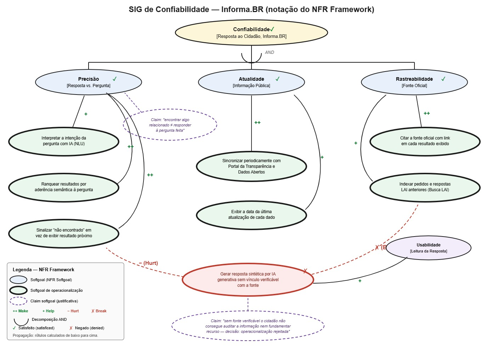
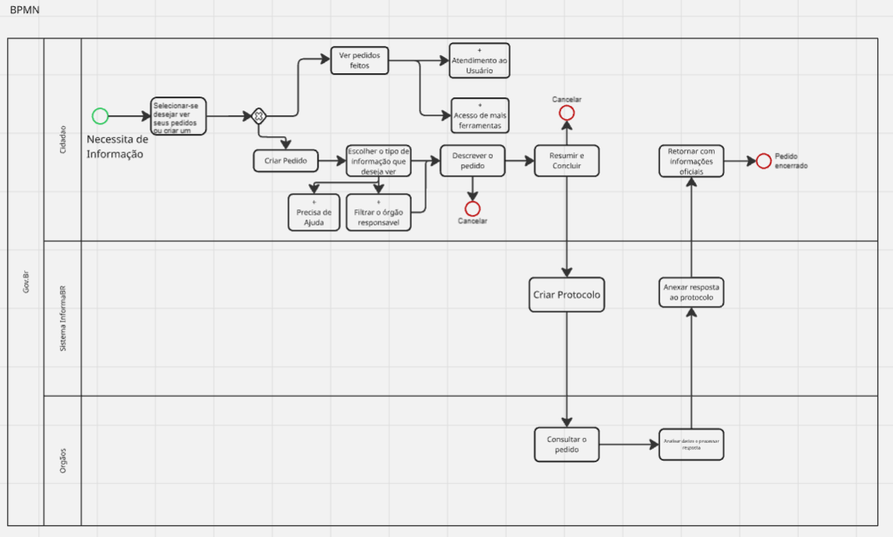

# SubEquipe_03

## FOCO_01: Artefatos Generalistas & NFR Framework

### Participantes no Foco_01

| Nome do Membro | Contribuição |
| --- | --- |
| João Paulo Barros | Elaboração do Rich Picture do InformaBR |
| Rivadalvio Joaquim | Elaboração do SIG de Confiabilidade (NFR Framework) |

### Metodologia do Foco_01

A execução do Foco_01 ocorreu de forma colaborativa e dividida entre os membros do subgrupo. O participante **Rivadalvio Joaquim** responsabilizou-se pela concepção e estruturação do SIG na notação do NFR Framework, enquanto o participante **João Paulo Barros** realizou o levantamento visual e a elaboração do **Rich Picture** focado na plataforma de governo eletrônico **InformaBR** (CGU).

Durante as reuniões de alinhamento, a equipe correlacionou os elementos do Rich Picture com os requisitos não funcionais observados no domínio — **confiabilidade da resposta**, **rastreabilidade da fonte** e **usabilidade** — de modo que o artefato generalista servisse de insumo direto para a construção do SIG (*Softgoal Interdependency Graph*). Essa correlação garantiu que os dois artefatos tratassem do mesmo recorte do problema, em vez de descreverem o sistema de forma independente.

### Rich Picture

Para a entrega do artefato generalista, foi elaborado o **Rich Picture do InformaBR**, mapeando o fluxo central de solicitação de informação da LAI (informações públicas, pessoais e de terceiros), a gestão de privacidade e identidade, a edição e o salvamento de rascunhos, além dos canais de suporte ao usuário (Fala.BR, Portal da Transparência e Portal de Dados Abertos).

### NFR Framework

Foi elaborado o **SIG de Confiabilidade** para o InformaBR. A escolha do critério partiu da tensão central observada no domínio durante a construção do Rich Picture: *encontrar algo relacionado à consulta não é o mesmo que responder à pergunta feita pelo cidadão*.

O softgoal raiz `Confiabilidade [Resposta ao Cidadão]` foi decomposto por **AND** em três subsoftgoals:

| Subsoftgoal | Justificativa |
| --- | --- |
| `Precisão [Resposta vs. Pergunta]` | O resultado precisa responder à pergunta formulada, não apenas ser tematicamente próximo. |
| `Atualidade [Informação Pública]` | Dado defasado leva o cidadão a decisão incorreta e gera pedido ou recurso desnecessário. |
| `Rastreabilidade [Fonte Oficial]` | Sem origem verificável, a informação não sustenta um pedido nem um recurso à CGU/CMRI. |

As operacionalizações aceitas e suas contribuições:

| Operacionalização | Contribui para | Tipo |
| --- | --- | --- |
| Interpretar a intenção da pergunta com IA (NLU) | Precisão | `+` Help |
| Ranquear resultados por aderência semântica à pergunta | Precisão | `++` Make |
| Sinalizar "não encontrado" em vez de exibir resultado próximo | Precisão | `++` Make |
| Sincronizar periodicamente com Portal da Transparência e Dados Abertos | Atualidade | `++` Make |
| Exibir a data da última atualização de cada dado | Atualidade | `+` Help |
| Citar a fonte oficial com link em cada resultado | Rastreabilidade | `++` Make |
| Indexar pedidos e respostas LAI anteriores (Busca LAI) | Rastreabilidade | `+` Help |

Registrou-se ainda uma **operacionalização rejeitada**: gerar resposta sintética por IA generativa sem vínculo verificável com a fonte. Ela contribui positivamente para a Usabilidade (`+`), porém **quebra** a Rastreabilidade (`✗ Break`) e prejudica a Precisão (`− Hurt`). Como a Rastreabilidade é decomposição AND obrigatória do softgoal raiz, a alternativa foi marcada como **negada (denied)**, sustentada pelo *claim*: *"sem fonte verificável, o cidadão não consegue auditar a informação nem fundamentar recurso"*.

Com as operacionalizações aceitas, os três subsoftgoals ficam `✓ satisficed`, propagando `✓` para o softgoal raiz **Confiabilidade**.

---

## FOCO_02: Engenharia Reversa & BPMN

### Participantes no Foco_02

| Nome | GitHub | Contribuição |
| --- | --- | --- |
| Isaac Lucas | [IsaacLusca](https://github.com/IsaacLusca) | Engenharia reversa comportamental do gerenciamento de consentimento de cookies, documentação dos achados, matriz de rastreabilidade e modelagem BPMN 2.0.2 |

### 1. Introdução

A engenharia reversa deste foco foi aplicada ao **InformaBR**, plataforma de transparência e acesso à informação da Controladoria-Geral da União, disponível em <https://informabr.cgu.gov.br/>. O recorte analisado foi o **gerenciamento de consentimento de cookies apresentado na interface pública**, por sua relação direta com privacidade de dados, usabilidade e experiência do usuário.

| Item de delimitação | Definição |
| --- | --- |
| Sistema-alvo | InformaBR — interface pública da CGU |
| Endereço analisado | <https://informabr.cgu.gov.br/> |
| Data da observação original | 24/08/2026 |
| Perspectiva | Cidadão que acessa o portal e define suas preferências de cookies |
| Processo selecionado | Gerenciamento de consentimento de cookies |
| Tipo de análise | Engenharia reversa comportamental, de caixa-preta |

Segundo Chikofsky e Cross (1990), a engenharia reversa analisa um sistema para identificar seus componentes e relações e produzir representações em nível mais alto de abstração. Neste trabalho, a análise foi comportamental e de caixa-preta: foram considerados somente controles, mensagens e mudanças de estado visíveis, sem acesso ao código-fonte, armazenamento, integrações ou infraestrutura do portal.

O fluxo recuperado foi formalizado com a **Business Process Model and Notation (BPMN) 2.0.2**, mantida pela Object Management Group (OMG).

### 2. Objetivo e escopo

O objetivo foi recuperar e documentar como o cidadão controla o consentimento de cookies ao acessar o InformaBR. O fluxo começa com a apresentação do painel e termina quando uma das escolhas disponíveis é aplicada:

1. aceitar todos os cookies;
2. rejeitar os cookies opcionais;
3. gerenciar as preferências e salvar uma seleção personalizada.

A análise não abrange a busca de informações nem o registro e acompanhamento de pedidos de acesso à informação, pois esses processos foram tratados pelas SubEquipes 02 e 01, respectivamente. Também não foram inferidos mecanismos internos de armazenamento, prazo de retenção, compartilhamento com terceiros ou implementação técnica dos cookies.

### 3. Metodologia do Foco_02

A engenharia reversa foi executada em cinco etapas:

| Etapa | Procedimento | Resultado |
| --- | --- | --- |
| 1. Delimitação | Separação do consentimento de cookies dos demais processos do portal | Escopo exclusivo e sem sobreposição com busca ou pedido LAI |
| 2. Exploração | Observação do painel e de suas alternativas na interface pública | Identificação das escolhas disponíveis ao cidadão |
| 3. Coleta de evidências | Registro dos rótulos e mudanças visíveis de estado | Lista de atividades e decisões observáveis |
| 4. Abstração | Conversão das evidências em eventos, tarefas, gateways e raias | Modelo comportamental AS-IS |
| 5. Validação | Conferência entre evidências, texto e notação BPMN 2.0.2 | Rastreabilidade entre interface e diagrama |

#### 3.1 Ferramentas e fontes utilizadas

| Recurso | Uso |
| --- | --- |
| Navegador web | Inspeção da interface pública e das opções de consentimento |
| Especificação BPMN 2.0.2 da OMG | Fundamentação e validação da notação |
| SVG | Publicação do diagrama de forma legível e ampliável |
| BPMN 2.0 XML | Preservação da fonte editável do modelo |
| Git e GitHub | Versionamento e rastreabilidade da documentação |

#### 3.2 Cuidados éticos e de privacidade

A análise não utilizou credenciais, não forneceu dados pessoais, não registrou pedido e não acessou áreas restritas. O modelo descreve apenas as escolhas apresentadas publicamente. Não se afirma como o consentimento é persistido, por quanto tempo permanece válido ou quais tecnologias internas executam cada preferência.

### 4. Processo de Engenharia Reversa Aplicado

#### 4.1 Estado inicial observado

Ao acessar a interface pública, o cidadão recebe um painel de consentimento de cookies. O painel apresenta três alternativas principais:

- **Aceitar todos os cookies**;
- **Rejeitar cookies opcionais**;
- **Gerenciar cookies**.

As alternativas revelam que o portal não limita a decisão a uma escolha binária entre aceitar tudo ou abandonar a navegação. Existe uma opção direta de recusa dos cookies opcionais e uma opção para personalizar preferências.

#### 4.2 Fluxo recuperado

O comportamento observável foi abstraído da seguinte forma:

1. o cidadão acessa o InformaBR;
2. o portal apresenta o painel de consentimento;
3. o cidadão escolhe uma das três alternativas;
4. se selecionar **Aceitar todos**, o portal aplica essa escolha;
5. se selecionar **Rejeitar cookies opcionais**, o portal aplica a recusa dos opcionais;
6. se selecionar **Gerenciar cookies**, o portal abre o gerenciamento de preferências;
7. o cidadão define a seleção desejada e solicita o salvamento;
8. o portal aplica a seleção e fecha o painel;
9. o cidadão continua utilizando a interface pública.

O diagrama representa somente respostas externas observáveis. A atividade “Aplicar escolha” significa que a interface aceita a decisão e permite a continuidade da navegação; ela não descreve banco de dados, mecanismo de persistência ou implementação técnica.

### 5. Achados e senso crítico

#### 5.1 Pontos positivos

- O cidadão pode rejeitar diretamente os cookies opcionais.
- O gerenciamento permite uma decisão mais granular que “aceitar todos”.
- As alternativas são apresentadas antes da continuidade normal da navegação.
- O fluxo está relacionado diretamente à autonomia do titular e à transparência sobre tratamento de dados.

#### 5.2 Limitações e oportunidades de melhoria

- A engenharia reversa de caixa-preta não permite confirmar como a escolha é armazenada ou aplicada internamente.
- A interface deveria manter facilmente acessível uma forma de revisar ou alterar a decisão posteriormente.
- As categorias do gerenciamento devem explicar finalidade, necessidade e possíveis terceiros de maneira compreensível.
- A navegação por teclado, a ordem do foco e a leitura por tecnologias assistivas devem ser verificadas para que a escolha seja acessível.
- As opções de aceitar, rejeitar e gerenciar devem evitar diferenças visuais que induzam o cidadão a uma escolha específica.

### 6. Modelagem BPMN

Foi modelado o fluxo de gerenciamento de consentimento de cookies do InformaBR. O processo é **AS-IS**, limitado ao comportamento observável, e contém duas raias: **Cidadão** e **InformaBR**.

#### 6.1 BPMN — Gerenciamento de consentimento de cookies

O processo começa quando o cidadão acessa o portal. O InformaBR apresenta o painel e um gateway exclusivo representa as três escolhas possíveis. Os caminhos de aceitação total, rejeição dos opcionais e personalização convergem após a aplicação da decisão. O processo termina com o painel fechado e a navegação disponível.

> Arquivo-fonte BPMN 2.0: [consentimento-cookies-informabr.bpmn](../Imagens/consentimento-cookies-informabr.bpmn)

### 7. Rastreabilidade

| Evidência observável | Elemento recuperado | Representação BPMN |
| --- | --- | --- |
| Acesso à interface pública | Início da interação | Evento inicial “Acessar InformaBR” |
| Painel de consentimento | Solicitação de decisão ao cidadão | Tarefa “Apresentar painel de cookies” |
| Botão “Aceitar todos” | Consentimento para todas as opções apresentadas | Caminho “Aceitar todos” |
| Botão “Rejeitar cookies opcionais” | Recusa direta dos opcionais | Caminho “Rejeitar opcionais” |
| Opção “Gerenciar cookies” | Acesso às preferências detalhadas | Caminho “Gerenciar” |
| Controles de preferência | Seleção personalizada | Tarefa do usuário “Definir preferências” |
| Ação de salvar | Confirmação da seleção personalizada | Tarefa “Aplicar seleção personalizada” |
| Fechamento do painel | Conclusão observável do fluxo | Evento final “Preferências aplicadas” |

### 8. Limitações da análise

Esta documentação representa o comportamento externo observado na interface do InformaBR. Alterações posteriores podem modificar rótulos, categorias ou transições. O modelo não representa arquitetura técnica, persistência do consentimento, validade temporal, cookies efetivamente instalados, integrações com terceiros ou operações não expostas publicamente.

---

## FOCO_03: IA Generativa

### Participantes no Foco_03

| Nome do Membro | Lições Aprendidas | Como a IA Generativa Auxiliou no Trabalho |
| --- | --- | --- |
| [André João](https://github.com/AJCGassassin) | O uso de IA para pesquisa e para o entendimento de conteúdos difíceis auxilia no desenvolvimento do trabalho e, em alguns casos, no desenvolvimento de software. Ainda assim, seu melhor uso é como apoio à pesquisa e como auxílio na retomada de conceitos já estudados. | A IA generativa auxiliou no entendimento necessário para a realização do BPMN e na compreensão do que caracteriza um bom Rich Picture. |
| [Isaac Lucas](https://github.com/IsaacLusca) | O entendimento do valor da IA como auxílio na modelagem, servindo para melhorar a compreensão dos conceitos de processos de negócio (BPMN) e de engenharia reversa. Ficou evidente a importância da verificação e validação humana para garantir a precisão técnica das regras do sistema-alvo (InformaBR). | Auxiliou no refinamento da documentação textual do fluxo do InformaBR, na validação da sintaxe e dos elementos da notação BPMN 2.0.2, na tradução de comportamentos observados em especificações formais e na estruturação dos dados de rastreabilidade do relatório. |
| João Paulo Barros | Compreendi na prática a transição entre um artefato informal e generalista (Rich Picture) e um modelo formal como o BPMN 2.0. Aprendi a mapear raias, eventos de início e fim e gateways de decisão exclusivos para um sistema de e-Gov (InformaBR). | Utilizei a ferramenta de IA generativa **Gemini** como assistente iterativo para tirar dúvidas sobre a norma do BPMN, estruturar a sequência lógica a partir da imagem do meu Rich Picture e gerar exemplos no Draw.io. Segue o resultado do BPMN que realizei, , neste relatório, a equipe tomou a decisão de utilizar a versão de Isaac. **Senso crítico:** a IA é eficaz para acelerar a estruturação inicial e sugerir a sintaxe dos elementos, mas apresentou limitações na interpretação direta de imagens e tendência a simplificar a semântica das raias. Isso exigiu que eu revisasse o conteúdo sobre construção de BPMN na literatura da disciplina para validar a consistência do fluxo final. |
| Rivadalvio Joaquim | A elaboração do SIG permitiu entender na prática como decompor o requisito de Confiabilidade e avaliar seus *trade-offs*, evidenciando que gerar respostas por IA sem vínculo com a fonte quebra a rastreabilidade e prejudica a auditabilidade pelo cidadão — o que justificou a rejeição formal dessa abordagem no diagrama. | A IA atuou como suporte técnico na sintaxe do NFR Framework, diferenciando *softgoals*, *claims* e tipos de contribuição (*Make*, *Help*, *Hurt*, *Break*). **Senso crítico:** as versões do diagrama geradas por modelos de imagem apresentaram texto corrompido e ramos duplicados, o que exigiu refazer o artefato em formato vetorial e conferir a notação na literatura (Chung et al., 2000). |

---

## Versionamentos

| Nome do Membro | Contribuição | Data |
| --- | --- | --- |
| [Isaac Lucas](https://github.com/IsaacLusca) | Engenharia reversa comportamental, documentação dos fluxos e especificação BPMN | 24/08/2026 |
| João Paulo Barros e Rivadalvio Joaquim | Criação do Foco_01: elaboração do Rich Picture do InformaBR e do SIG de Confiabilidade (NFR Framework) | 25/08/2026 |
| [André João](https://github.com/AJCGassassin) | Foco_03 (IA generativa), junção das partes e correções | 27/08/2026 |
| Rivadalvio Joaquim | Detalhamento da seção NFR Framework, correção do caminho do artefato do SIG e revisão textual do relatório | 27/08/2026 |
| João Paulo Barros | Revisão textual do relatório, adição de imagem e contribuição | 28/08/2026 |
| [Isaac Lucas](https://github.com/IsaacLusca) | Redefinição do escopo do Foco_02 para o gerenciamento de consentimento de cookies, atualização da engenharia reversa, rastreabilidade e BPMN | 31/08/2026 |

---

## Referências

BRASIL. **Lei nº 12.527, de 18 de novembro de 2011**. Regula o acesso a informações. Brasília, DF: Presidência da República, 2011. Disponível em: <https://www.planalto.gov.br/ccivil_03/_ato2011-2014/2011/lei/l12527.htm>. Acesso em: 24 ago. 2026.

BRASIL. **Lei nº 13.709, de 14 de agosto de 2018**. Lei Geral de Proteção de Dados Pessoais (LGPD). Brasília, DF: Presidência da República, 2018. Disponível em: <https://www.planalto.gov.br/ccivil_03/_ato2015-2018/2018/lei/L13709compilado.htm>. Acesso em: 24 ago. 2026.

BRASIL. Controladoria-Geral da União. **Plataforma de Transparência e Acesso à Informação**. Disponível em: <https://informabr.cgu.gov.br/>. Acesso em: 24 ago. 2026.

BRASIL. Governo Federal. **Registrar pedido de acesso à informação na plataforma de transparência e acesso à informação**. Atualizado em 14 jul. 2026. Disponível em: <https://www.gov.br/pt-br/servicos/acessar-informacoes-de-orgaos-publicos>. Acesso em: 24 ago. 2026.

CHIKOFSKY, Elliot J.; CROSS II, James H. **Reverse engineering and design recovery: a taxonomy**. *IEEE Software*, v. 7, n. 1, p. 13–17, 1990. DOI: <https://doi.org/10.1109/52.43044>.

CHUNG, Lawrence; NIXON, Brian A.; YU, Eric; MYLOPOULOS, John. **Non-Functional Requirements in Software Engineering**. Boston: Springer, 2000.

OBJECT MANAGEMENT GROUP. **Business Process Model and Notation (BPMN), Version 2.0.2**. 2014. Disponível em: <https://www.omg.org/spec/BPMN/2.0.2/>. Acesso em: 24 ago. 2026.
