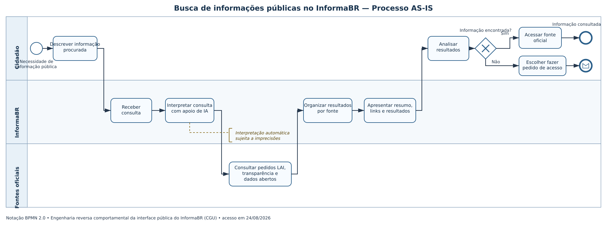

# SubEquipe_03

## Focos do Relatório:

| Nome do Membro | --- |
| --- | --- |
| João Paulo Barros | Fiz o rich Picture/Mapa Mental |
| Rivadalvio Joaquim | Fiz o NFR Framework |

### Metodologia do Foco_01
A execução do Foco 01 ocorreu de forma colaborativa e dividida entre os membros do subgrupo. O participante Riva responsabilizou-se pela concepção e estruturação dos Mapas Mentais do projeto, enquanto o participante João Paulo Barros realizou o levantamento visual e a elaboração do **Rich Picture** focado na plataforma do governo eletrônico **InformaBR** (CGU). Durante reuniões de alinhamento, a equipe correlacionou o Rich Picture com os requisitos não-funcionais (como usabilidade, privacidade da informação e transparência) para posterior representação do SIG (Softgoal Interdependency Graph) na notação do NFR Framework.
### Rich Picture OU Mapa Mental
Para a entrega do artefato generalista, foi elaborado o **Rich Picture do InformaBR**, mapeando o o fluxo central de solicitação de informação da LAI (públicas, pessoais e de terceiros), a gestão de privacidade/identidade, a edição e salvamento de rascunhos, além dos canais de suporte ao usuário (Fala BR, Portal da Transparência e Dados Abertos).

**Rich Picture**

### NFR Framework

### Participantes no Foco_02

| Nome | GitHub | Contribuição |
| --- | --- | --- |
| Isaac Lucas | [IsaacLusca](https://github.com/IsaacLusca) | Engenharia reversa da interface pública, levantamento dos fluxos, documentação dos achados e especificação dos modelos BPMN |

### 1. Introdução

A engenharia reversa deste foco foi aplicada ao **InformaBR**, plataforma de transparência e acesso à informação da Controladoria-Geral da União, disponível em <https://informabr.cgu.gov.br/>. O projeto **G5_ProjetoGovernoEletronico** utiliza o serviço como sistema-alvo para recuperar, pela perspectiva do cidadão, funcionalidades, decisões de navegação e requisitos relacionados à privacidade e à experiência do usuário.

| Item de delimitação | Definição |
| --- | --- |
| Sistema-alvo | InformaBR — interface pública da CGU |
| Endereço analisado | <https://informabr.cgu.gov.br/> |
| Data da observação | 24/08/2026 |
| Perspectiva | Cidadão que pesquisa informação pública e pode iniciar um pedido |
| Tipo de análise | Engenharia reversa comportamental, de caixa-preta |

Segundo Chikofsky e Cross (1990), a engenharia reversa consiste na análise de um sistema para identificar seus componentes e relações e produzir representações em um nível mais alto de abstração. Neste trabalho, essa análise foi aplicada como uma **engenharia reversa comportamental, de caixa-preta**, pois se apoiou apenas nas telas, respostas visíveis e documentação pública, sem acesso ao código-fonte, banco de dados, APIs privadas ou infraestrutura interna.

Os comportamentos recuperados foram representados por meio da **Business Process Model and Notation (BPMN) 2.0.2**, mantida pela Object Management Group (OMG). A notação foi escolhida por permitir a diferenciação entre participantes, atividades, eventos, decisões e trocas de informação em processos de negócio.

### 2. Objetivo e escopo

O objetivo foi recuperar e documentar o fluxo principal utilizado por um cidadão para:

1. pesquisar informações já publicadas em fontes oficiais;
2. avaliar os resultados apresentados;
3. iniciar um pedido de acesso à informação quando a busca não for suficiente;
4. selecionar o tipo de informação e o órgão responsável;
5. descrever, revisar e concluir o pedido;
6. receber um protocolo e acompanhar a resposta.

O levantamento foi limitado à perspectiva do cidadão. Rotinas internas de triagem, distribuição, análise jurídica, classificação de sigilo e produção da resposta pelo órgão público não foram inferidas, pois não são observáveis na interface analisada.

### Metodologia do Foco_02

A engenharia reversa foi realizada em cinco etapas:

| Etapa | Procedimento | Resultado |
| --- | --- | --- |
| 1. Delimitação | Definição do fluxo central e dos limites da análise | Busca pública e registro de pedido de acesso à informação |
| 2. Exploração | Navegação sistemática pelas páginas públicas e execução de uma consulta genérica, sem uso de dados pessoais | Identificação de telas, ações, mensagens e alternativas de navegação |
| 3. Coleta de evidências | Registro dos rótulos, etapas e decisões observáveis, complementado por documentação oficial | Lista de atividades e regras confirmadas |
| 4. Abstração | Conversão das observações em atores, eventos, tarefas, gateways e fluxos | Especificação textual dos diagramas BPMN |
| 5. Validação | Comparação do fluxo recuperado com as orientações oficiais do serviço e com a notação BPMN 2.0.2 | Correção de lacunas e separação entre evidência e inferência |

#### 3.1 Ferramentas e fontes utilizadas

| Recurso | Uso |
| --- | --- |
| Navegador web | Inspeção das telas e execução controlada do fluxo público |
| Documentação oficial do serviço no GOV.BR | Confirmação das etapas de registro, protocolo e acompanhamento |
| Especificação BPMN 2.0.2 da OMG | Fundamentação da notação |
| BPMN 2.0, SVG e PNG | Construção do modelo, preservação da fonte editável e publicação da imagem validada |
| Git e GitHub | Versionamento, rastreabilidade e publicação da documentação |

#### 3.2 Cuidados éticos e de privacidade

A análise não utilizou credenciais, não anexou documentos, não submeteu pedido real e não forneceu dados pessoais. Foi empregada apenas uma consulta genérica para observar a resposta da busca pública. O formulário foi percorrido somente até os pontos necessários para identificar seus componentes e decisões, sem concluir qualquer operação.

### Processo de Engenharia Reversa Aplicado

#### 4.1 Reconhecimento da página inicial

A página inicial apresenta a busca de informações públicas como ação principal. Também oferece acessos diretos para:

- fazer um pedido;
- visualizar pedidos anteriores;
- consultar um pedido por protocolo;
- acessar fontes externas de transparência e dados abertos;
- consultar pedidos já respondidos.

A interface oferece recursos de acessibilidade, como contraste, aumento e redução do texto e integração com VLibras. Também apresenta um painel de consentimento de cookies com opções para gerenciar, rejeitar cookies opcionais ou aceitar todos.

#### 4.2 Recuperação do fluxo de busca pública

O fluxo observado para a busca pública foi:

1. o cidadão descreve em linguagem natural a informação desejada;
2. o sistema processa a consulta;
3. a aplicação apresenta uma interpretação gerada por inteligência artificial, acompanhada de aviso sobre possíveis imprecisões;
4. o sistema organiza referências e resultados provenientes de diferentes fontes oficiais;
5. o cidadão navega entre categorias, como pedidos de acesso já respondidos, Portal da Transparência e Portal de Dados Abertos;
6. o cidadão avalia se encontrou o que precisava;
7. caso encontre, acessa a fonte oficial selecionada;
8. caso não encontre, pode iniciar o registro de um pedido de acesso à informação.

Essa organização revela uma estratégia de **transparência ativa primeiro**: o sistema tenta reutilizar informações já publicadas antes de iniciar um novo processo administrativo.

#### 4.3 Recuperação do fluxo de registro do pedido

O registro do pedido apresenta inicialmente três categorias:

- informações públicas;
- informações pessoais do próprio solicitante;
- informações pessoais de outra pessoa.

Para o caso de informação pública, o assistente conduz o usuário por quatro etapas visíveis:

1. **Órgão responsável:** pesquisa e seleção do órgão ou entidade que deverá responder;
2. **Descrição do pedido:** texto do pedido, possibilidade de anexar arquivos e opção de preservar a identidade;
3. **Resumo do pedido:** revisão das informações fornecidas;
4. **Conclusão:** confirmação e finalização.

A documentação oficial complementa o comportamento observável: o cidadão deve utilizar autenticação GOV.BR, recebe o número de protocolo por e-mail e pode acompanhar o pedido pela área “Meus pedidos”. O prazo normal de resposta é de até 20 dias, prorrogável por mais 10 dias mediante justificativa.

#### 4.4 Elementos de privacidade recuperados

Foram identificados os seguintes mecanismos relacionados à privacidade:

| Mecanismo observado | Relação com privacidade e experiência do usuário |
| --- | --- |
| Classificação do tipo de informação | Diferencia informação pública de dados pessoais próprios ou de terceiros |
| Aviso no campo de descrição | Orienta o cidadão a evitar informações pessoais que não sejam essenciais |
| Opção “Preserve minha identidade” | Permite solicitar restrição da identificação no tratamento do pedido |
| Gerenciamento de cookies | Oferece recusa dos cookies opcionais e personalização do consentimento |
| Aviso sobre interpretação por IA | Informa que a interpretação automática pode conter imprecisões |
| Autenticação GOV.BR | Centraliza a validação da identidade para a conclusão e o acompanhamento do serviço |

Esses mecanismos são coerentes com a necessidade de conciliar a publicidade prevista na Lei de Acesso à Informação com a proteção de dados pessoais estabelecida pela Lei Geral de Proteção de Dados Pessoais.

### 5. Achados e senso crítico

#### 5.1 Pontos positivos

- A busca pública aparece antes do formulário, reduzindo pedidos duplicados e esforço administrativo.
- A interpretação da consulta por IA é sinalizada como conteúdo sujeito a imprecisões.
- Os resultados são separados por fonte, o que ajuda o cidadão a compreender sua procedência.
- O formulário utiliza etapas numeradas, deixando o progresso explícito.
- A seleção do tipo de informação torna visível a diferença entre informação pública e dado pessoal.
- O campo de descrição alerta contra a inclusão desnecessária de informações pessoais.
- A opção de preservação da identidade está integrada ao fluxo de solicitação.
- Recursos de acessibilidade e controle de cookies são oferecidos na interface pública.

#### 5.2 Limitações e oportunidades de melhoria

- A resposta da busca assistida por IA não é imediata; durante o processamento, o usuário precisa aguardar sem previsão de tempo.
- Uma consulta pode produzir muitos resultados e textos extensos, elevando a carga cognitiva.
- A separação entre o resumo gerado por IA e os resultados recuperados precisa permanecer visualmente evidente para evitar que uma interpretação seja confundida com informação oficial.
- O controle de preservação da identidade poderia apresentar, no mesmo ponto da decisão, uma explicação curta sobre alcance, exceções e consequências.
- A interface permite iniciar o assistente de registro antes de autenticar o cidadão, embora a documentação informe que a autenticação GOV.BR é obrigatória. Essa diferença deve ser esclarecida no projeto para evitar surpresa ou perda de dados perto da conclusão.
- A engenharia reversa de caixa-preta não permite afirmar como os dados, anexos, registros de consentimento ou consultas são armazenados e compartilhados internamente.

### Modelagem BPMN

Foi modelado o fluxo público de busca do InformaBR por ser o processo central observado na interface e por conduzir o cidadão da necessidade inicial até a consulta de uma fonte oficial ou o encaminhamento para um pedido de acesso. O modelo representa o processo **como observado e documentado (AS-IS)** e atende à entrega mínima de um fluxo em BPMN.

#### BPMN — Busca de informações públicas no InformaBR

O modelo contém as raias **Cidadão**, **InformaBR** e **Fontes oficiais**. O processo inicia com a descrição da informação procurada, passa pela interpretação assistida por IA, consulta pedidos LAI respondidos, Portal da Transparência e bases de dados abertos, organiza e apresenta os resultados. O gateway exclusivo “Informação encontrada?” separa o acesso à fonte oficial do encaminhamento para o registro de um pedido de acesso à informação.

> Arquivo-fonte BPMN 2.0: [`busca-informacoes-publicas.bpmn`](./assets/bpmn/busca-informacoes-publicas.bpmn)

### 7. Rastreabilidade

| Evidência | Elemento recuperado | Representação BPMN |
| --- | --- | --- |
| Campo “Descreva sua busca” | Entrada livre da necessidade do cidadão | Tarefa do usuário “Descrever informação procurada” |
| Resumo e interpretação gerados por IA | Processamento e apresentação de interpretação | Tarefa de serviço “Interpretar consulta” |
| Abas de resultados por fonte | Consulta e organização de fontes oficiais | Tarefas de serviço e fluxo de mensagem |
| Pergunta sobre o resultado encontrado | Decisão do cidadão | Gateway exclusivo “Informação encontrada?” |
| Opção “Fazer pedido” | Alternativa à transparência ativa | Evento de ligação com o segundo processo |
| Seleção do tipo de informação | Classificação do pedido | Gateway exclusivo |
| Seleção do órgão responsável | Definição do destinatário | Tarefa do usuário |
| Descrição, anexos e preservação de identidade | Composição do pedido e decisões de privacidade | Tarefas e gateways |
| Resumo e conclusão | Revisão e confirmação | Tarefas do usuário |
| Autenticação GOV.BR | Validação de identidade | Pool externo e fluxo de mensagem |
| Protocolo e acompanhamento | Confirmação e consulta posterior | Evento de mensagem e tarefa do usuário |
| Resposta do órgão | Resultado administrativo | Tarefa do órgão e evento de mensagem |

### 8. Limitações da análise

Esta documentação representa apenas o comportamento externo do InformaBR recuperado em 24 de agosto de 2026. Alterações posteriores da interface podem tornar partes do fluxo desatualizadas. O modelo não representa arquitetura técnica, integrações internas, regras de autorização, persistência, segurança de anexos ou procedimentos administrativos não expostos publicamente.

### 10. Referências

BRASIL. **Lei nº 12.527, de 18 de novembro de 2011**. Regula o acesso a informações. Brasília, DF: Presidência da República, 2011. Disponível em: <https://www.planalto.gov.br/ccivil_03/_ato2011-2014/2011/lei/l12527.htm>. Acesso em: 24 ago. 2026.

BRASIL. **Lei nº 13.709, de 14 de agosto de 2018**. Lei Geral de Proteção de Dados Pessoais (LGPD). Brasília, DF: Presidência da República, 2018. Disponível em: <https://www.planalto.gov.br/ccivil_03/_ato2015-2018/2018/lei/L13709compilado.htm>. Acesso em: 24 ago. 2026.

BRASIL. Controladoria-Geral da União. **Plataforma de Transparência e Acesso à Informação**. Disponível em: <https://informabr.cgu.gov.br/>. Acesso em: 24 ago. 2026.

BRASIL. Governo Federal. **Registrar pedido de acesso à informação na plataforma de transparência e acesso à informação**. Atualizado em 14 jul. 2026. Disponível em: <https://www.gov.br/pt-br/servicos/acessar-informacoes-de-orgaos-publicos>. Acesso em: 24 ago. 2026.

CHIKOFSKY, Elliot J.; CROSS II, James H. **Reverse engineering and design recovery: a taxonomy**. *IEEE Software*, v. 7, n. 1, p. 13–17, 1990. DOI: <https://doi.org/10.1109/52.43044>.

OBJECT MANAGEMENT GROUP. **Business Process Model and Notation (BPMN), Version 2.0.2**. 2014. Disponível em: <https://www.omg.org/spec/BPMN/2.0.2/>. Acesso em: 24 ago. 2026.

#
## FOCO_03: IA Generativa

### Participantes no Foco_03
|Nome do Membro| lições Aprendidas | Como a IA Generativa Auxiliou no Trabalho|
| --- | --- | --- |
| [André João](https://github.com/AJCGassassin) | O uso de IA para pesquisas e entendimento de contéudos difíceis auxília no melhor desenvolvimento do trabalho, bem como ajuda em alguns casos no desenvolvimento de um software, apesar de que o melhor uso do mesmo é para pesquisa e auxílo de quando se esquece de algo. | A IA generativa auxiliou  ao melhor entendimento para a realização do BPMN e de como é um bom Rich Picture|
| [Isaac Lucas](https://github.com/IsaacLusca) |O entendimento do valor da IA como auxílio na modelagem, servindo para melhorar o entendimento dos conceitos dos processos de negócio (BPMN) e engenharia reversa. Ficou evidente a importância da verificação evalidação de uma pessoa para garantir a precisão técnica das regras do sistema-alvo (InformaBR). | Auxiliou no refinamento da documentação textual do fluxo do InformaBR, na validação de sintaxe e elementos da notação BPMN 2.0.2, na tradução de comportamentos observados em especificações formais e na estruturação de dados de rastreabilidade do relatório. |
| **João Paulo Barros** | Compreendi pela prática a transição entre um artefato informal/generalista (Rich Picture) para um modelo formal como o BPMN v2. Fui Aprender como mapear raias , eventos de início/fim e gateways de decisão exclusivos para um sistema de e-Gov (InformaBR). | Utilizei a ferramenta de IA Generativa **Gemini** como assistente iterativo para tirar dúvidas sobre a norma do BPMN, sobre como estruturar a sequência lógica a partir da imagem do meu Rich Picture e gerar exemplos no Draw.io. **Senso Crítico:** A IA é excelente para acelerar a estruturação inicial e sugerir a sintaxe dos elementos, porém ela apresentou algumas limitações na interpretação direta das imagens e tendência a simplificar a semântica das raias. Isso exigiu que eu revisa-se o conteúdo de como montar um BPMN e na literatura da disciplina para validar a consistência do fluxo final. |
| **Riva** | A elaboração do SIG permitiu entender na prática como decompor o requisito de Confiabilidade e avaliar seus trade-offs, evidenciando que gerar respostas por IA sem fontes diretas quebra a rastreabilidade e prejudica a auditabilidade do cidadão, o que justificou a rejeição dessa abordagem no diagrama. | A IA atuou como suporte técnico na sintaxe do NFR Framework (diferenciando Softgoals, Claims e impactos como Make e Break), além de ajudar a refinar a terminologia de requisitos e a estruturar as justificativas de projeto para o Informa.BR. |

#
## Versionamentos
| Nome do Membro | Contribuição | Data |
| --- | --- | --- |
| [Isaac Lucas](https://github.com/IsaacLusca) | Engenharia reversa comportamental, documentação dos fluxos e especificação BPMN | 24/08/2026 |
| **João Paulo Barros** & **Riva** | Criação do Foco 01: Elaboração do Rich Picture do InformaBR e Estruturação dos Mapas Mentais. | 25/08/2026 |
| [André João](https://github.com/AJCGassassin)|IA generativa, junção das partes, algumas correções | 27/08/2026 |